# PaaS and Kubernetes

## Content

- [PaaS and Kubernetes](#paas-and-kubernetes)
  - [Content](#content)
  - [A. Kiến thức cơ bản liên quan về PaaS và Kubernetes](#a-kiến-thức-cơ-bản-liên-quan-về-paas-và-kubernetes)
    - [**1. Platform as a Service**](#1-platform-as-a-service)
    - [**2. Kubernetes**](#2-kubernetes)
    - [**3. Kubernetes Components**](#3-kubernetes-components)
  - [B. Install Kubernetes on PC by using mini-kube](#b-install-kubernetes-on-pc-by-using-mini-kube)
    - [**1. Cài đặt và cấu hình kubectl**](#1-cài-đặt-và-cấu-hình-kubectl)
    - [**2. Cài đặt và cấu hình minikube**](#2-cài-đặt-và-cấu-hình-minikube)
  - [C. Write manifest file to deploy the system of Wordpess on the Kubernetes](#c-write-manifest-file-to-deploy-the-system-of-wordpess-on-the-kubernetes)
    - [1. mariadb-deployment.yaml](#1-mariadb-deploymentyaml)
    - [2. wordpress-deployment.yaml](#2-wordpress-deploymentyaml)
    - [Deploy](#deploy)
  - [DEBUG](#debug)
    - [Các phương pháp debugging pods](#các-phương-pháp-debugging-pods)
    - [Một số lỗi có thể gặp](#một-số-lỗi-có-thể-gặp)
  - [Tài liệu tham khảo](#tài-liệu-tham-khảo)

---

## A. Kiến thức cơ bản liên quan về PaaS và Kubernetes

### **1. Platform as a Service**

Nền tảng là một dịch vụ (PaaS) là mô hình điện toán đám mây trong đó nhà cung cấp bên thứ ba cung cấp các công cụ phần cứng và phần mềm – thường là những công cụ cần thiết để phát triển ứng dụng – cho người dùng qua internet. Một nhà cung cấp PaaS lưu trữ phần cứng và phần mềm trên cơ sở hạ tầng của riêng mình . Do đó, PaaS giải phóng các nhà phát triển khỏi việc phải cài đặt phần cứng và phần mềm nội bộ để phát triển hoặc chạy một ứng dụng mới.

### **2. Kubernetes**

**2.1 Official Definition**

*"Kubernetes (K8s) is an open-source system for automating deployment, scaling, and management of containerized applications."*

- Open source **container orchestration tool**
- Developed by **Google**
- Helps you **manage containerized applications** in different **deployment environments**
  - physical
  - virtual
  - cloud

    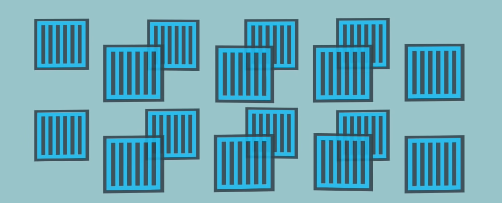

```
 Xét dưới góc độ phần cứng thì Kubernetes là một tập hợp các node. Node là một máy vật lý hoặc máy ảo

Các node trong Kubernetes được chia thành 2 loại:

- worker node: chạy các Docker container
- master node: quản lý, điều phối các container trên worker node

Các node trong Kubernetes gộp lại thành 1 cluster. Kubernetes nhìn cluster này như một máy tính duy nhất, mỗi node được thêm vào hay gỡ ra khỏi cluster thì cũng giống như thêm hoặc bớt CPU/RAM cho cụm máy
<https://techmaster.vn/posts/35919/khoa-hoc-kubernetes-cho-nguoi-moi-bat-dau-phan-1-cung-tim-hieu-ve-kien-truc-cua-kubernetes>

```

**2.2 Problem-Solution case study**

The need for a container orchestration tool

- Trend from **Monolith** to **Microservices**
- Increased usage of **containers**
- Demand for a **proper way** of **managing** those hundreds of containers
  
    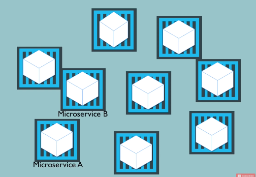
  
**2.3 What features do orchestration tools offer?**

- **High Availability** or no downtime
- **Scalability** or high performance
- **Disaster recovery** - backup and restore

### **3. Kubernetes Components**

Main Kubernetes Components sumnaried

> - Node and Pod: abstraction of containers
> - Service: communication
> - Ingress: route trafic into cluster
> - ConfigMap: external configuration
> - Secrets; secure external configuration
> - Volumes
> - Statefulset
> - Deployment
>
>   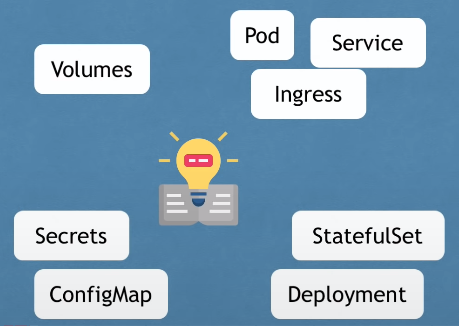

---
3.1 Node and Pod

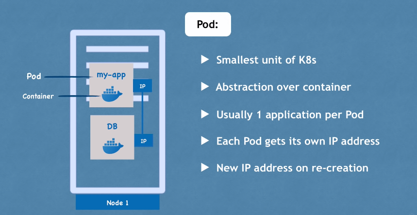

3.2 Service and Ingress

- Services
  - permanent IP address
  - load balancer
  - lifecycle of Pod and Service NOT connected (mỗi lần pod gặp vấn đề cần restart hoặc replace thì IP address của pod sẽ không thay đổi)
  - External service/ Internal service
- Ingress
  - translate domain name to IP address ( sau do chuyen toi service )
  
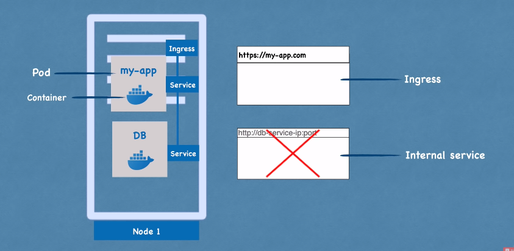

3.3 ConfigMap and Secrets

- ConfigMap:
  - external configuration of your application
  - Giúp chúng ta không phải tạo lại image mỗi lần thay đổi thông số
- Secrets
  - tương tự configMap nhưng secure hơn
  - Used to store secret data
  - base64 encoded
  
    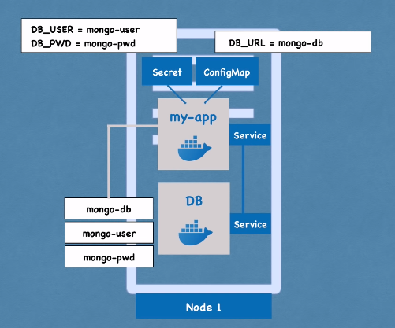

3.4 Volumes

Mỗi lần có vấn đề, hoặc khởi động lại, data storage trong container sẽ mất đi. Do đó ta cần phải có chỗ lưu trữ database cố định.
K8s Cluster thường kết nối với Storage ở ngoài

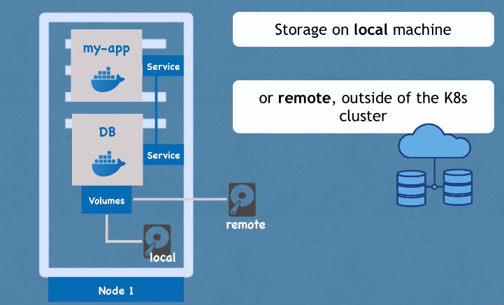

3.5 Deployment

Bạn sẽ không làm việc với Pod, không tạo thêm pod mà Deployments sẽ định nghĩa việc đó. Từ đó scale số replica của pod.

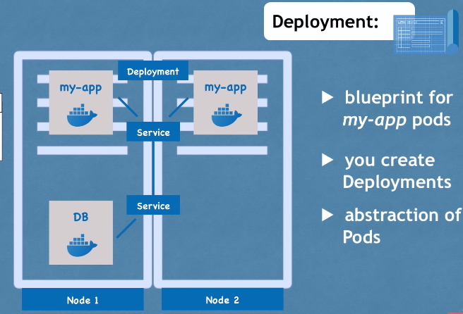

3.6 StatefulSet

Đối với database thì không thể clone, hoặc khi clone chúng ra vẫn phải truy cập vào cùng 1 volumes cũ, từ đó sinh ra StatefulSet

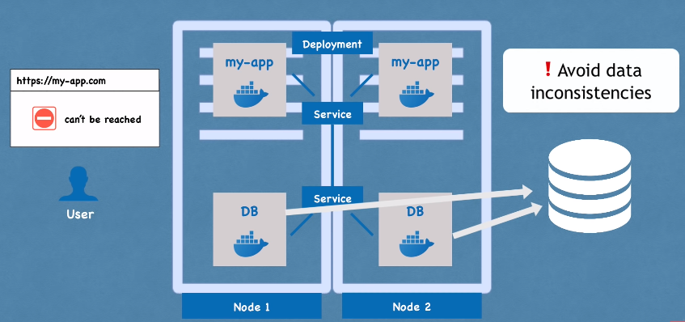
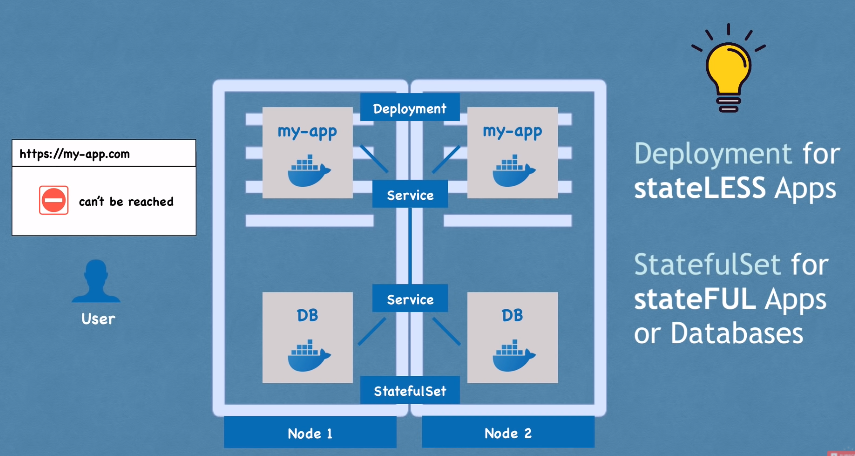

Deploying StatefulSet not easy -> DB are often hosted outside of K8s cluster to not affect cluster.

---

## B. Install Kubernetes on PC by using mini-kube

*Used to Test/Local cluster Setup: Master and Node processes run on ONE machine*

**Chuẩn bị cấu hình cài đặt**

### **1. Cài đặt và cấu hình kubectl**

Công cụ command-line trong Kubernetes, kubectl, cho phép bạn thực thi các câu lệnh trong Kubernetes clusters. Bạn có thể sử dụng kubectl để triển khai các ứng dụng, theo dõi và quản lý tài nguyên của cluster, và xem log. Để biết các thao tác của kubectl, truy cập tới  [Tổng quan về kubectl.](https://kubernetes.io/docs/reference/kubectl/overview/)

- Dễ dàng cài đặt sử theo hướng dẫn tại [Install-kubectl-linux](https://kubernetes.io/docs/tasks/tools/install-kubectl-linux/)

### **2. Cài đặt và cấu hình minikube**

 Minikube, một công cụ chạy một Kubernetes cluster chỉ gồm một node trong một máy ảo (VM) trên máy tính của bạn.

- Để kiểm tra xem việc ảo hóa (virtualization) có được hỗ trợ trên Linux không, chạy lệnh sau và chắc chắn rằng kết quả trả về là non-empty.
  
  ```console
  grep -E --color 'vmx|svm' /proc/cpuinfo
  ```

- Cài đặt Hypervisor
  - KVM, sử dụng QEMU
  - VirtualBox

- Cài đặt Minikube thông qua tải xuống trực tiếp

```console
curl -Lo minikube https://storage.googleapis.com/minikube/releases/latest/minikube-linux-amd64 \
&& chmod +x minikube
```

- Thêm Minikube vào biến môi trường path

```console

sudo mkdir -p /usr/local/bin/
sudo install minikube /usr/local/bin/

```

- Tạo tài khoản *minikube* trên ubuntu và group nó vào cùng với sudo và docker

```console
sudo adduser minikube

sudo usermod -aG sudo minikube
sudo usermod -aG docker minikube 

newgrp docker
```

- Truy nhập vào user mới

```console
su minikube
```

- Kiểm tra version sẽ cho thấy

```
minikube version: v1.21.0
commit: 76d74191d82c47883dc7e1319ef7cebd3e00ee11
```


---

## C. Write manifest file to deploy the system of Wordpess on the Kubernetes

Ta sẽ viết định nghĩa các component để deploy Wordpress và lưu nó vào 2 file wordpress-deployment.yaml và mariadb-deployment.yaml

### 1. mariadb-deployment.yaml

- Service

```yaml
apiVersion: v1
kind: Service
metadata:
  name: mariadb-server
  labels:
    app: wordpress
spec:
  ports:
    - port: 3306
  selector:
    app: wordpress
    tier: mariadb
    author: bitnami
  clusterIP: None

```

- PersistentVolumeClaim

```yaml
apiVersion: v1
kind: PersistentVolumeClaim
metadata:
  name: wordpress-mariadb-volume
  labels:
    app: wordpress
spec:
  accessModes:
    - ReadWriteOnce
  resources:
    requests:
      storage: 2Gi
```

- Deployment

```yaml
apiVersion: apps/v1
kind: Deployment
metadata:
  name: wordpress-mariadb
  labels:
    app: wordpress
spec:
  selector:
    matchLabels:
      app: wordpress
      tier: mariadb
      author: bitnami
  strategy:
    type: Recreate
  template:
    metadata:
      labels:
        app: wordpress
        tier: mariadb
        author: bitnami
    spec:
      containers:
      - name: mariadb
        image: bitnami/mariadb:latest
        env:
        - name: ALLOW_EMPTY_PASSWORD
          value: "yes"
        - name: MARIADB_USER
          value: fil_wordpress
        - name: MARIADB_DATABASE
          value: bitnami_wordpress
        - name: MARIADB_PASSWORD
          value: fil
        ports:
        - containerPort: 3306
        volumeMounts:
        - name: mariadb-volume
          mountPath: /var/lib/mariadb
      volumes:
      - name: mariadb-volume
        persistentVolumeClaim:
          claimName: wordpress-mariadb-volume
```


### 2. wordpress-deployment.yaml

- Service

```yaml
apiVersion: v1
kind: Service
metadata:
  name: wordpress
  labels:
    app: wordpress
spec:
  ports:
    - port: 8080
  selector:
    app: wordpress
    tier: frontend
    author: bitnami
  type: LoadBalancer

```

- PersistentVolumeClaim

```yaml
apiVersion: v1
kind: PersistentVolumeClaim
metadata:
  name: wordpress-volume
  labels:
    app: wordpress
spec:
  accessModes:
    - ReadWriteOnce
  resources:
    requests:
      storage: 2Gi
```

- Deployment

```yaml
apiVersion: apps/v1
kind: Deployment
metadata:
  name: wordpress
  labels:
    app: wordpress
spec:
  selector:
    matchLabels:
      app: wordpress
      tier: frontend
      author: bitnami
  strategy:
    type: Recreate
  template:
    metadata:
      labels:
        app: wordpress
        tier: frontend
        author: bitnami
    spec:
      containers:
      - name: wordpress
        image: bitnami/wordpress:latest
        env:
          - name: ALLOW_EMPTY_PASSWORD
            value: "yes"
          - name: WORDPRESS_DATABASE_USER
            value: fil_wordpress
          - name: WORDPRESS_DATABASE_NAME
            value: bitnami_wordpress
          - name: WORDPRESS_DATABASE_PASSWORD
            value: fil
          - name: WORDPRESS_DATABASE_HOST
            value: mariadb-server
        ports:
        - containerPort: 80
          name: wordpress
        volumeMounts:
        - name: wordpress-storage
          mountPath: /var/www/html
      volumes:
      - name: wordpress-storage
        persistentVolumeClaim:
          claimName: wordpress-volume
```

### Deploy

NOTE: Thông thường trong các bài toán người ta sẽ tạo một vùng chứa các tên và mật khẩu có tính bảo mật cho các file manifest này gọi là **secret** sau đó sẽ referent vào các file deployment.... Trong bài này để đơn giản chúng ta sẽ gán trực tiếp các thông số vào mà không cần mã hóa.

- MariaDB

```console
kubectl apply -f ./mariadb-deployment.yml
```

- Wordpress

```console
kubectl apply -f ./wordpress-deployment.yml
```
- Kiểm tra các kết quả và lấy địa chỉ truy cập wordpress


ở đây ta có địa chỉ: <http://192.168.49.2:31735>

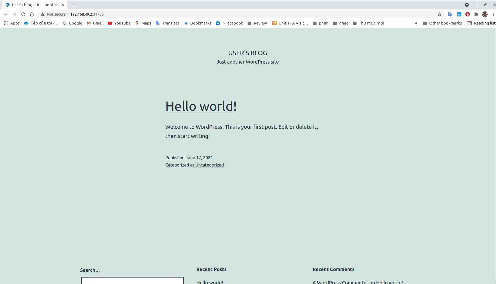

---

## DEBUG

### Các phương pháp debugging pods

- Sử dụng câu lênh để xem logs của pod

```console
kubectl get pod
kubectl logs [pod-name]
```

- Get Interactive terminal

```console
kubectl exec -it [pod-name] -- bin/bash
```

### Một số lỗi có thể gặp

- The connection to the server 192.168.49.2:8443 was refused - did you specify the right host or port?

Trường hợp này chúng ta chỉ cần stop minikube và start lại là được.

---

## Tài liệu tham khảo

1. <https://kubernetes.io/vi/docs/tasks/tools/_print/#pg-bbdc530b292ab4074d1dfe69feafb3e7>
2. <https://kubernetes.io/docs/tutorials/stateful-application/mysql-wordpress-persistent-volume/>
3. <https://cloudfun.vn/threads/tim-hieu-cach-dinh-cau-hinh-ung-dung-kubernetes-bang-configmap.399/>
4. <https://viblo.asia/p/kubernetes-kubectl-va-cac-command-co-ban-gAm5yJaLKdb>
5. <https://www.youtube.com/watch?v=X48VuDVv0do&t=2846s>